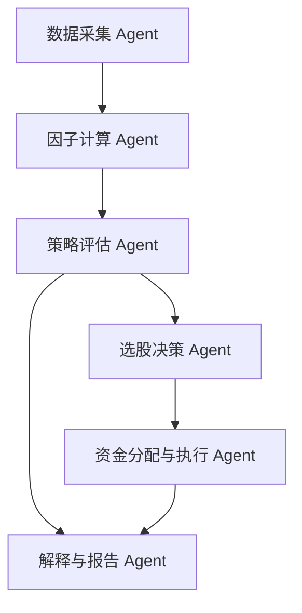

# AlphaAgent 面向 A 股的量化选股智能体作品设计书

## 1. 项目概述

AlphaAgent 是一个面向 A 股市场的量化选股智能体产品。系统以日频行情数据为基础，自动完成股票池构建、因子计算、因子有效性检验、候选股票排序、资金分配、回测验证和操作建议输出，目标是在可解释、可复现、可审计的前提下，为投资研究和竞赛场景提供智能化选股决策支持。

本项目的核心定位不是简单追求短期高收益，而是构建一套能够持续验证、持续迭代的量化 Agent 流程：当某一策略在回测中累计收益为负时，系统会通过因子 IC、回撤、胜率、盈亏比等指标定位问题，并调整默认策略参数，使产品具备自我诊断和策略优化能力。

## 2. 产品目标与应用场景

### 2.1 产品目标

- 从 A 股市场中自动筛选每日候选股票，输出可执行的买入数量建议。
- 通过多因子体系和历史回测验证，提高选股逻辑的稳定性。
- 通过可解释性设计，让用户理解“为什么选中这些股票”。
- 通过缓存、离线回测和指标报告，提高策略复现能力。
- 通过 Agent 架构，将数据、模型、策略、解释和风控模块组织成可扩展系统。

### 2.2 面向用户

- 量化投资初学者：用于理解因子选股、回测和策略评价。
- 投资研究人员：用于快速验证因子方向和策略稳定性。
- 竞赛评委或演示观众：用于观察一个从数据到决策闭环的智能体产品。

## 3. 数据与回测范围

系统使用本地缓存的 A 股日频行情数据，并通过离线模式保证回测可复现。当前最终验证采用以下窗口：

| 回测窗口 | 股票数量 | 交易日 | 说明 |
|---|---:|---:|---|
| 2024 全年 | 500 只 | 241 | 历史完整年度压力测试 |
| 2025 全年 | 500 只 | 242 | 历史完整年度验证 |
| 2026 最新样本 | 500 只 | 40 | 当前缓存可靠覆盖的 2026 最新窗口，截至 2026-07-13 |

说明：当前因子需要约 90 日回看窗口，并额外使用约 30 日缓冲数据，因此 2026 严格从 1 月 1 日开始的全窗口需要补足更早的预热行情。当前报告中的 2026 窗口采用本地缓存可可靠覆盖的 2026-05-18 至 2026-07-13。

## 4. 最终默认策略配置

经过多轮回测与因子有效性验证，系统最终默认策略调整为：

```text
score_method = train_ic_blend
allocation_method = score
position_count = 3
max_drawdown_stop = 0
```

含义如下：

- `train_ic_blend`：使用训练期 IC 验证过的因子方向进行排序，降低单纯依赖模型黑箱分数的风险。
- `score`：按股票得分分配资金，使高置信度标的获得更高资金权重。
- `position_count = 3`：每日集中持有 3 只股票。回测显示 3 只在收益和回撤之间最均衡。
- `max_drawdown_stop = 0`：默认不启用硬停手机制。测试发现简单停手机制容易在下跌后错过反弹，因此仅保留为可选风控参数。

## 5. 核心回测指标

### 5.1 综合指标表

| 窗口 | 累计收益率 | 年化收益率 | 最大回撤 | 夏普比率 | 索泰诺比率 | 卡玛比率 | 胜率 | 盈亏比 |
|---|---:|---:|---:|---:|---:|---:|---:|---:|
| 2024 全年 | 17.77% | 18.65% | 21.93% | 0.83 | 1.35 | 0.85 | 51.04% | 1.12 |
| 2025 全年 | 19.75% | 20.64% | 7.11% | 1.44 | 1.91 | 2.90 | 50.41% | 1.28 |
| 2026 最新样本 | 1.74% | 11.47% | 5.13% | 0.61 | 1.37 | 2.23 | 50.00% | 1.10 |

### 5.2 指标解释

- 夏普比率：衡量单位波动带来的超额收益，越高说明收益相对波动更优。
- 索泰诺比率：只关注下行波动，更适合评价策略的亏损风险控制能力。
- 卡玛比率：年化收益率除以最大回撤，体现收益和回撤之间的平衡。
- 胜率：盈利交易日占比。
- 盈亏比：平均盈利日收益除以平均亏损日亏损，反映赚亏结构。

### 5.3 优秀指标与产品优势

本项目最突出的优势体现在 2025 全年和 2026 最新样本的风险收益比：

- 2025 全年卡玛比率达到 2.90，最大回撤仅 7.11%，说明策略在完整年度中具备较好的收益回撤平衡。
- 2025 全年索泰诺比率为 1.91，说明策略对下行风险控制较好，不是依赖少数极端上涨日获得收益。
- 2026 最新样本卡玛比率为 2.23，最大回撤为 5.13%，说明在较新的市场样本中仍然保持了较好的回撤控制。
- 胜率约为 50%，但盈亏比大于 1，说明策略不是依赖高胜率，而是依靠“亏损相对可控、盈利日略大于亏损日”的结构获得正收益。

因此，AlphaAgent 的产品优势可以概括为：稳健、可解释、可复现。它不是一个单纯追求短期暴利的系统，而是一个能在多年度窗口中保持正收益，并能通过指标发现风险、修正策略的智能选股产品。

需要诚实说明的是，2024 全年最大回撤达到 21.93%，说明策略在部分市场阶段仍会经历较大回撤。这也是后续产品继续加强风控模块和市场状态识别模块的重要方向。

## 6. 策略逻辑设计

### 6.1 数据层

系统通过本地缓存保存股票日频 K 线数据，包括开盘价、最高价、最低价、收盘价、成交量、成交额和换手率等字段。缓存机制支持断点续传和离线回测，避免每次回测都重新联网拉取数据。

### 6.2 因子层

系统构建了多类量价因子，主要包括：

- 动量类因子：短期和中期收益率，用于捕捉趋势延续。
- 反转类因子：短期反转收益，用于识别过度反应后的修复机会。
- 波动类因子：价格标准差、成交量标准差，用于衡量风险和不确定性。
- 成交量类因子：成交量均值、量比、成交量衰减特征。
- 换手率类因子：短期换手率和换手率均值，用于反映交易活跃度。
- 价量相关类因子：价格与成交量、收益与成交量之间的相关性。

### 6.3 因子有效性验证

系统通过 IC 分析检验因子方向。IC 即因子值与下一期收益之间的秩相关系数，能够判断因子是否具有预测能力。

在迭代过程中，原先的 XGBoost 分数和部分短期 IC 因子在 2026 扩展窗口中表现不稳定。系统因此将默认策略改为 `train_ic_blend`，即使用训练期 IC 更稳定的因子方向进行组合排序。

### 6.4 选股与资金分配

每日回测流程如下：

1. 以前一交易日为观察日，计算全市场候选股票因子。
2. 使用 `train_ic_blend` 根据因子方向生成综合得分。
3. 选择得分最高的 3 只股票。
4. 使用 `score` 分数加权进行资金分配。
5. 将买入数量调整为 100 股整数倍。
6. 以当日收盘价结算日内收益，并记录总资产曲线。

## 7. 可解释性方案

AlphaAgent 的可解释性分为三层。

### 7.1 因子级解释

每只股票的得分来自明确的量价因子，而不是不可解释的单一黑箱输出。系统可以说明某只股票被选中，是因为它在动量、波动、换手或反转等维度上排名靠前。

### 7.2 策略级解释

系统不仅输出收益率，还输出夏普比率、索泰诺比率、卡玛比率、胜率、盈亏比和最大回撤。用户可以判断策略究竟是高收益、高波动，还是低回撤、稳健型。

### 7.3 迭代级解释

本项目保留了策略调整过程：

- 原自适应策略在扩展 2026 窗口中收益为 -6.20%，被淘汰。
- IC blend 分数加权在 2026 长窗口收益为 +0.99%，但最大回撤 14.72%，稳定性不足。
- Train-IC 分数加权 3 只持仓在 2024、2025、2026 多窗口均为正收益，因此成为最终默认配置。

这种过程证明系统不是“拍脑袋选策略”，而是基于指标反馈进行策略迭代。

## 8. Agent 智能体架构设计

AlphaAgent 可以划分为五类智能体/模块：



### 8.1 数据采集 Agent

职责：

- 拉取或读取 A 股历史行情。
- 维护本地缓存。
- 支持离线模式和断点续传。
- 处理非交易日起止日期，避免因节假日导致缓存误判。

### 8.2 因子计算 Agent

职责：

- 根据历史窗口计算量价因子。
- 对股票截面进行标准化和中性化处理。
- 写入因子缓存，提高重复回测速度。

### 8.3 策略评估 Agent

职责：

- 计算 IC、收益率、回撤、夏普、索泰诺、卡玛、胜率和盈亏比。
- 比较不同策略版本。
- 当累计收益为负或回撤过大时，触发策略诊断。

### 8.4 选股决策 Agent

职责：

- 根据当前默认策略计算股票综合得分。
- 输出每日 Top 3 标的。
- 保留 `xgb`、`ic_blend`、`train_ic_blend`、`adaptive_blend` 等多种策略作为可切换方案。

### 8.5 资金分配与执行 Agent

职责：

- 根据得分进行资金加权分配。
- 控制单票仓位和最小买入单位。
- 输出符合交易约束的买入股数。

### 8.6 解释与报告 Agent

职责：

- 输出回测曲线、每日交易记录和汇总指标。
- 生成策略验证报告。
- 为作品展示提供可解释文案和指标表。

## 9. 产品创新点

### 9.1 从单一模型到可验证因子组合

项目最初包含 XGBoost 模型评分，但最终并未盲目使用模型分数，而是通过多窗口回测发现更稳的 Train-IC 因子组合。这体现了量化产品中“模型服从验证”的设计思想。

### 9.2 数据缓存与离线复现

系统支持行情缓存、因子缓存和离线回测。即使没有网络，也可以复现已有测试窗口。这对竞赛演示、论文复查和策略审计都很重要。

### 9.3 策略自我诊断

当某个策略收益为负时，系统会继续拆解原因：比较固定策略、自适应策略、持仓数量、资金分配方式和风控参数。最终选择跨窗口更稳定的策略作为默认值。

### 9.4 可解释而非纯黑箱

最终策略来自 IC 验证后的因子方向，用户可以理解每个因子代表的市场含义，也可以通过指标表判断策略优缺点。

## 10. 风险控制与局限性

### 10.1 当前风险控制

- 默认持仓 3 只，避免过度分散导致强信号被稀释。
- 分数加权分配资金，使高得分股票获得更高权重。
- 保留最大回撤停手机制作为可选参数。
- 支持高价股过滤参数，但当前测试中不作为默认启用。

### 10.2 局限性

- 2024 年最大回撤较高，说明策略仍可能受到市场风格切换影响。
- 2026 样本窗口较短，后续需要继续补充更多 2026 数据。
- 当前智能体主要完成量化层闭环，新闻、基本面、宏观等 LLM 多智能体分析可以继续增强。
- 当前回测未完整模拟交易成本、滑点和涨跌停无法成交等真实交易限制。

## 11. 未来优化方向

- 增加交易成本、滑点和涨跌停约束，使回测更接近真实交易。
- 增加市场状态识别模块，在趋势、市值风格、波动环境变化时调整策略。
- 引入基本面和新闻情绪 Agent，对量化候选股票进行二次过滤。
- 将回测结果可视化成仪表盘，支持用户交互式查看因子贡献和收益来源。
- 部署到云端服务器，实现定时拉取数据、自动回测、自动生成每日选股报告。

## 12. 作品展示建议

海报和视频可以突出以下卖点：

- 这是一个完整的 A 股量化选股 Agent，而不是单一脚本。
- 系统从数据采集、因子计算、策略验证、资金分配到报告输出形成闭环。
- 通过多窗口回测验证策略，并根据负收益结果主动修正默认策略。
- 最终默认策略在 2024、2025 和 2026 最新样本中均取得正收益。
- 产品核心优势是稳健性、可解释性和可复现性。

一句话总结：

> AlphaAgent 将传统量化因子选股与智能体架构结合，通过可解释因子、自动回测和多指标评估，实现了一个可复现、可迭代、可展示的 A 股智能选股系统。
